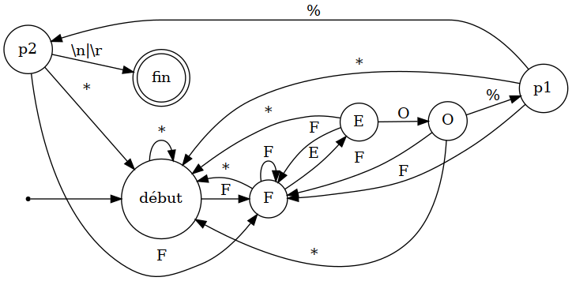

# Outil de validation d'un fichier PDF

## Compilation du projet
Pour compiler le projet, il est nécessaire d'avoir un compilateur C++ récent (testé uniquement avec G++ 10.3 sur Ubuntu 21.04) et d'avoir Bazel d'installé.

```bash
bazel build //src:pdf_end --compilation_mode opt
```

Le binaire produit se trouve dans un sous répertoire:

```
bazel-bin/src/pdf_end
```

## Solution développée
L'outil de validation est écrite en C++14 et repose sur les appels systèmes POSIX (Linux/macOS/iOS/Android).
Il utilise le mapping mémoire de fichier qui permet un accès direct aux données du fichier sans effectuer de copie.

On utilise la granularité du système d'exploitation pour représenter un fichier: une page du MMU.
Cette granularité est de 4 kio sur x86, mais peut être plus élevée sur d'autres architectures comme ARM (e.g. 64 kio sur le ARM d'Apple)

On lit le fichier par chunks de donnée dont on augmente la taille si l'on ne trouve pas d'occurences.

La lecture se fait par la fin du fichier.

Pour l'accès au fichier, le programme procède ainsi:
- On initialise le chunk à une page.
- On commence à lire la dernière page (ou les deux dernières pages) du fichier.
- Tant qu'il n'y a pas d'occurence de ``%%EOF``:
  - on double la taille du chunk une fois (on arrête si ce chunk dépasse les 1 Mo)
  - on charge en mémoire le chunk en le faisant terminer à l'endroit où le chunk précédent commençait

Pour détecter la dernière occurrence de ``%%EOF``, on parcourt le chunk de mémoire en partant de la fin.

Trouver la chaîne à partir de la fin peut être décrit par un simple automate à état fini:


Le seul élément posant problème dans cet automate est le retour à l'état début où F suivant la lettre lue.
La solution est de garder la dernière lettre lue et de revenir au début pour analyser à nouveau la lettre F.


